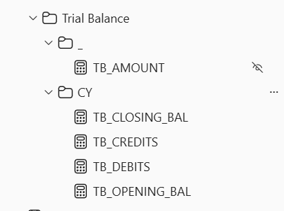

# Trial Balance Measures
\

# TB_Amount
TB Amount is the main measure that is reused in all other measures, this measure returns total amount for ledger, voucher etc.., in selected period

**Note :** this measure should not be used in any report directly as this method will result double amounts (debits and credits) ,so In report view it will be hidden

# TB_Debits
TB Debits uses TB Amount and gets only debits of ledger, voucher etc.., for current period

# TB_Credits
TB Debits uses TB Amount and gets only credits of ledger, voucher etc.., for current period

# TB_Opening_BAL

TB Opening Balance has opening balance of selected period
Ex: when selected period is F.Y 2022-23, you will get balance as on 31st March 2022

**Note :** when using opening balance make sure there is only one continious period say one F.Y, two F.Y's, oneQuarter, one Month , 
etc.., Dont select period with gaps say Selecting q1 and q4 in slicer or m1 ,m3, m6 in slicer there is breaking in period

# TB_Closing_BAL
TB Closing Balance has closing balance of selected period means it is sum of openingbalance + debits + credits
Ex: when selected period is F.Y 2022-23, you will get balance as on 31st March 2023

**Note :** since we use opening balance in this measure, we cannot select breaking period

# Usage 
All these measures except TB_Amount can be used in context of Ledger, Group, VoucherType, Voucher

Since I already defined relations there is no extra setup required and these measures works fine with above mentioned context

# Use Cases
 - We provide Trial Balance using these measures
 - We also used these measures in P&L Measures and BalanceSheet Measures
 - Using TB_Debits , TB_Credits with group context we can create group summary
 - Using TB_Debits , TB_Credits with ledger context we can create group summary
 - Using TB_Debits , TB_Credits with voucher context we can create voucher summary
